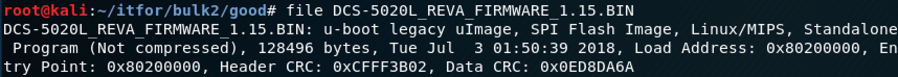

# IT Forensics Final Project Blog Post 

In this blog post, we will go through the full firmware analysis and extraction process. We will utilize tools such as binwalk, DD, firmwalker, strings and a decompression tool. We will discuss two approaches to extract the filesystem, the first using DD and the second using binwalk. 

#### Tools and Files Needed:
##### 1. Firmware file for device. We will be using the [D-Link DCS-5020L Camera](https://support.dlink.ca/ProductInfo.aspx?m=DCS-5020L).
##### 2. [Binwalk](https://github.com/ReFirmLabs/binwalk)
##### 3. [Firmwalker](https://github.com/craigz28/firmwalker)

#### Step 1: Choose Device
The first step of this process is to choose an IoT device to analyze. We have chosen the D-Link DCS-5020L network camera. This $120 camera has many features such as a wide viewing range with pan/tilt, mobile app functionality and can even function as a Wi-Fi extender. 

#### Step 2: Acquire Firmware File
Next, we need to acquire the firmware file for this IoT camera. As this device is updated manually, we need to go to the D-Link support site and download the firmware file, linked above. 

#### Step 3: Analyze File
Next, we need to learn a little bit more about the firmware file we have downloaded. We want to make sure it isn’t compressed, encrypted or corrupted. We can do this by running the file command on the firmware file. It appears that the firmware file is not corrupt or encrypted, and it is for the 5020L IoT Camera. 

#### Step 4: Analyze the image using Binwalk
The next step is to analyze the image using a Binwalk. This will tell us some important details about the content of the image. As per the image below, There appears to be a UBOOT bootloader at the 99360 offset. The OS is Linux and it is running MIPS architecture. At offset 327744 there is some LZMA compressed data, which is the file system. The uImage header above it says it is a OS Kernel Image compressed with LZMA. 

#### Step 5: Entropy Analysis Before Extraction
Before we extract the file, we can do entropy analysis to determine if the entire file system is compressed. We can use Binwalk with the “-e” flag to do this. Running the command in the following figure displays entropy output and an entropy plot. As per the entropy plot, the entire firmware file appears to have a high entropy, which makes sense, as the file system is compressed. 

###### Entropy Command:

###### Entropy Plot: 

#### Step 6: Extracting the compressed file system using DD
The next step is to extract the file system from the firmware file. To do this, we need to provide an input file, output file, bytes to skip, byte size and number of bytes. The *skip* and *count* fields are determined from the Binwalk output when initially analyzing the file. The *bs* (byte size) field can remain as 1.

The *skip* field can be determined using the “decimal” or offset value in the original Binwalk output. This value is 327744. 

The *count* field is the image size, which can also be determined by the original Binwalk output. This value is 7301445. 

#### Step 7: Decompress the extracted file
Now that we have extracted the file system, the next step is to decompress it. As per the previous binwalk output, we have determined that the LZMA file compression algorithm was used. The file can be extracted using the command below:

#### Step 8: Analyze File System Using the Strings Utility
Now that we have extracted and decompressed the file system, we can use the strings utility to search for interesting things. For example, we can determine the type of file system by searching for known file system keywords such as “file system”, “CIFS” or “squashfs”. As per the following image, we can confirm that the DCS-5020L IoT camera uses the SquashFS file system. 

We can further confirm this by searching specifically for squashfs:

#### Step 9: Extracting File System Using Binwalk
Using the “eM” flags in Binwalk, we are able to extract the root filesystem of the camera. The “-e” flag will extract all files identified during the initial file signature scan. The “-M” flag will recursively scan extracted files.

After this command is executed, you will need to traverse multiple directories until the “cpio-root” directory is found, which will contain the root directory of the file system:

#### Step 10: Searching the filesystem using Firmwalker
Now that we have the root directory extracted, we can use Firmwalker to analyze the firmware file for interesting things such as passwords, private keys, emails, IP’s, etc. To use this tool, you must download the script from the Firmwalker github page, and point it to the root directory of the firmware file (the previously extracted cpio-root directory):

Firmwalker produces lots of output, however some interesting findings are present below. It appears the camera has some telnet binaries installed and it has found some private keys: 

If we take it one step further, we can find the private key of the camera in /etc_ro/serverkey.pem:

